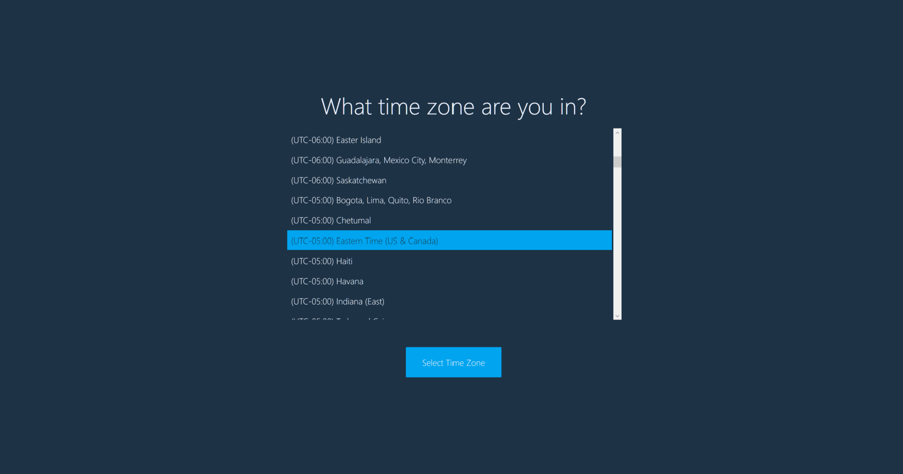
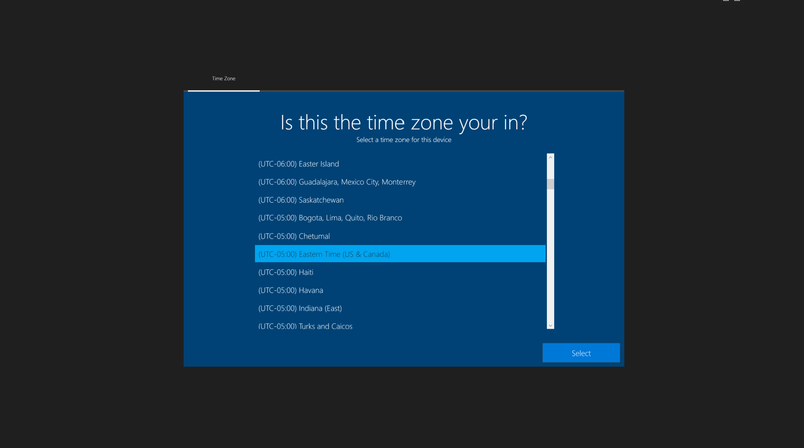

# Select a Time Zone

## Overview

I wrote this UI in PowerShell for users to change the time zone on their device. This was originally intended for a user to select their time zone on first logon right after AutoPilot ESP because there is not time zone selection for during Autopilot.

## The Look

I wanted the this to window to look and feel like something from Windows Out-of-Box-Experience (OOBE).

Simple (TimeZoneUI.ps1)


Windows 10 OOBE version (Win10_TimeZoneUI.ps1)


Windows 11 (coming soon)


## How to Use

```powershell

<#
    .SYNOPSIS
        Prompts user to set time zone

    .DESCRIPTION
		Prompts user to set time zone using windows presentation framework
        Can be used in:
            - SCCM Tasksequences (User interface allowed)
            - SCCM Software Delivery (User interface allowed)
            - Intune Autopilot

    .NOTES
        Launches in full screen using WPF

    .LINK
        https://matthewjwhite.co.uk/2019/04/18/intune-automatically-set-timezone-on-new-device-build/
        https://ipstack.com
        https://azuremarketplace.microsoft.com/en-us/marketplace/apps/bingmaps.mapapis

    .PARAMETER IpStackAPIKey
        Used to get geoCoordinates of the public IP. get the API key from https://ipstack.com

    .PARAMETER BingMapsAPIKeyy
        Used to get the Windows TimeZone value of the location coordinates. get the API key from https://azuremarketplace.microsoft.com/en-us/marketplace/apps/bingmaps.mapapis

    .PARAMETER UserDriven
        deploy to user sets either HKCU key or HKLM key
        Set to true if the deployment is for autopilot
        NOTE: Permission required for HKLM

    .PARAMETER OnlyRunOnce
        Specify that this script will only launch the form one time.

    .PARAMETER ForceTimeSelection
        Disabled and with Bing API --> Current timezone and geo timezone will be compared; if different, form will be displayed
        Enabled --> the selection will always show

    .PARAMETER AutoTimeSelection
        Enabled with Bing API --> No prompt for user, time will update on it own
        Enabled without Bing API --> User will be prompted at least once
        Ignored if ForceTimeSelection is enabled

    .PARAMETER UpdateTime
        Used only with IPstack and Bing API
        Set local time and date (NOT TIMEZONE) based on GEO location
        Requires administrative permissions

    .EXAMPLE
        PS> .\TimeZoneUI.ps1 -IpStackAPIKey = "4bd1443445dfhrrt9dvefr45341" -BingMapsAPIKey = "Bh53uNUOwg71czosmd73hKfdHf465ddfhrtpiohvknlkewufjf4-d" -Verbose

        Uses IP GEO location for the pre-selection

    .EXAMPLE
        PS> .\TimeZoneUI.ps1 -ForceTimeSelection

        This will always display the time selection screen; if IPStack and BingMapsAPI included the IP GEO location timezone will be preselected

    .EXAMPLE
        PS> .\TimeZoneUI.ps1 -IpStackAPIKey = "4bd1443445dfhrrt9dvefr45341" -BingMapsAPIKey = "Bh53uNUOwg71czosmd73hKfdHf465ddfhrtpiohvknlkewufjf4-d" -AutoTimeSelection -UpdateTime

        This will set the time automatically using the IP GEO location without prompting user. If API not provided, timezone or time will not change the current settings

    .EXAMPLE
        PS> .\TimeZoneUI.ps1 -UserDriven $false

        Writes a registry key in HKLM hive to determine run status

    .EXAMPLE
        PS> .\TimeZoneUI.ps1 -OnlyRunOnce $true

        Mainly for Autopilot powershell scripts; this allows the screen to display one time after ESP is completed.
#>
```

## Ready to deploy?

### For Autopilot

- This is only tested on a single user device. have not tested it on multiuser or Kiosk device.
- This runs in User context but for the device


1. Login into <https://endpoint.microsoft.com>
1. Navigate to Devices-->Scripts
1. Click _Add_ --> Windows 10 and Later
1. give it a name (eg. Win10 TimeZone Selector)
1. Import the PowerShell script
1. Select **Yes** for Run this script using the logged on credentials
1. Select **No** for Enforce script signature check
1. Select **No** for Run script in 64 bit PowerShell Host
1. Build an Azure Dynamic Device Group using query:

```kusto
    (device.devicePhysicalIDs -any _ -contains "[ZTDID]")
```

1. Assign script to Azure Dynamic Device Group


# DISCLAIMER

THE SOFTWARE IS PROVIDED "AS IS", WITHOUT WARRANTY OF ANY KIND, EXPRESS
OR IMPLIED, INCLUDING BUT NOT LIMITED TO THE WARRANTIES OF MERCHANTABILITY,
FITNESS FOR A PARTICULAR PURPOSE AND NONINFRINGEMENT. IN NO EVENT SHALL THE
AUTHORS OR COPYRIGHT HOLDERS BE LIABLE FOR ANY CLAIM, DAMAGES OR OTHER
LIABILITY, WHETHER IN AN ACTION OF CONTRACT, TORT OR OTHERWISE, ARISING
FROM, OUT OF OR IN CONNECTION WITH THE SOFTWARE OR THE USE OR OTHER
DEALINGS IN THE SOFTWARE.
